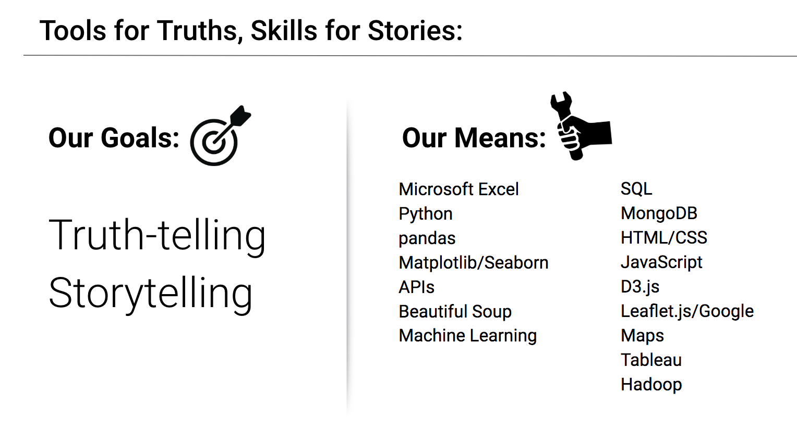
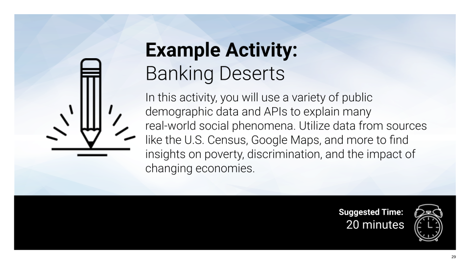
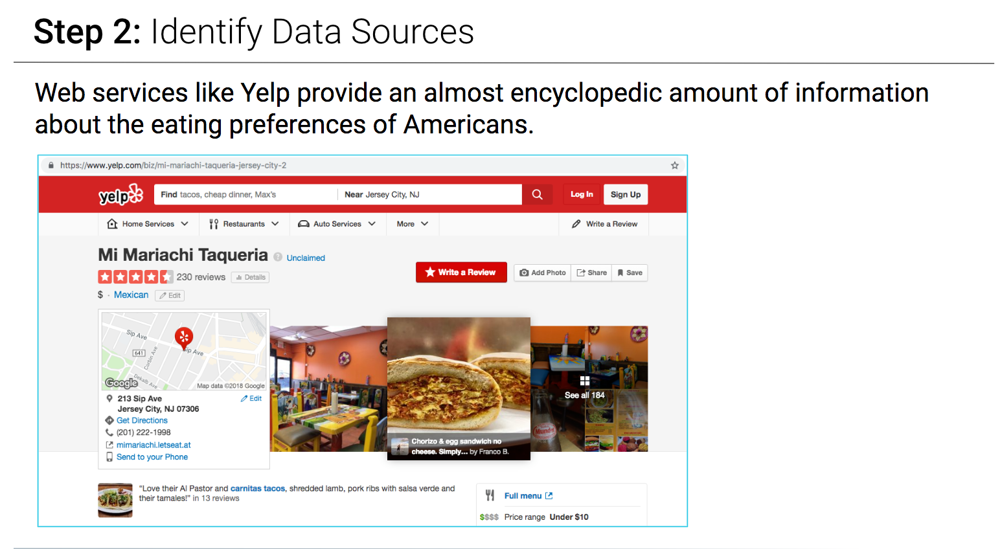
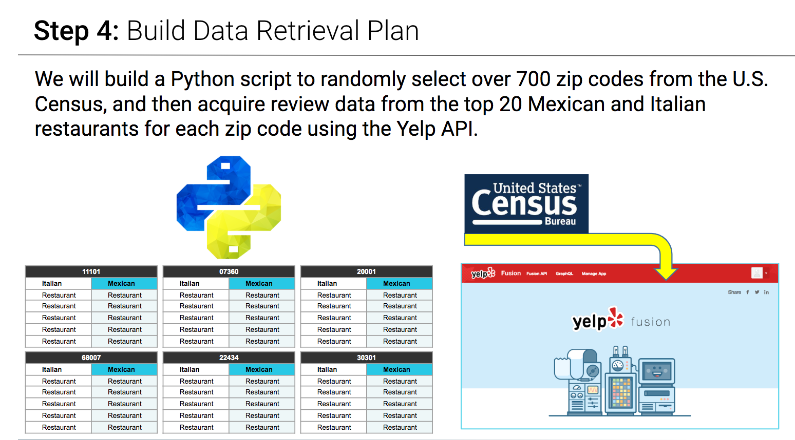
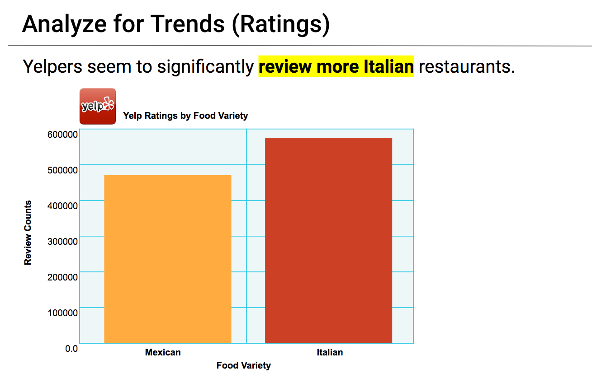
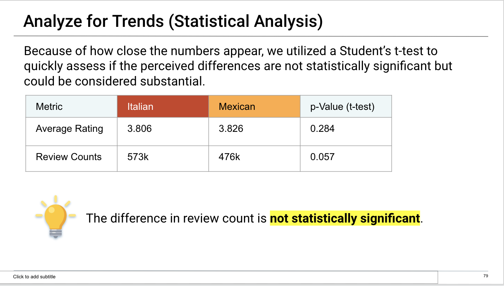
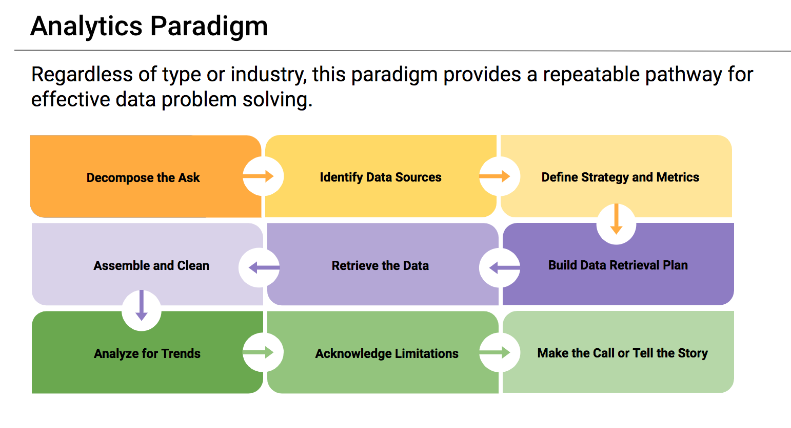

# 1.1: Introduction to Data

## Overview

In this class, students will become familiar with the class structure and course topics. They will also introduce themselves to their fellow students and complete two group activities to encourage teamwork and analytic thinking.

## Class Objectives

By the end of this lesson, the students will:

* Have an understanding of the course structure and general direction of the program
* Be familiar with high-level analytic strategies and tools.
* Have introduced themselves and completed icebreaker activities.

## Instructor Prep

    
<strong>Instructor Notes</strong>

* First off, welcome! Thank you for being a part of our program. Because of instructors and TAs like you, we're helping thousands of students achieve their goals and creative dreams. You've got plenty of road ahead to make an impact. So, buckle in! You're in for a fun ride.

* Today's class is all about making students feel comfortable. By the end of class, students should feel welcome, excited, and ready to begin the rigorous journey ahead. Show them that you and your TAs are committed to their success and are here to support them throughout their journey. This will help build camaraderie and reduce their first-day jitters.

* It's important to set the right tone on the first day, so come to class prepared. We encourage you to practice aloud at home and think through your presentation carefully. This doesn't mean you need to memorize the lesson word for word, but you should become very comfortable with the material. On the first day, students will be more alert to any signs of unpreparedness. Later, once you've established a rapport with your students, you can lighten your preparation a bit.

* Today's class will also set student expectations for this program. Some students may expect the classroom experience to be like their high school or college classes, with lectures, exams, and nagging feelings of insecurity. It's important they realize that this class will be different. As an instructor, your objective is to ensure that every class feels like a vibrant community of learning.

* This class is also about making students feel comfortable with _each other_. This lesson is filled with thought exercises and data-based problems that students will work on together in teams. Ensure that these activities lead to meaningful conversations by circulating the classroom and asking probing questions as appropriate. Do your best to keep the environment lighthearted.

* For this class and the next few classes, we'll be using slideshows as needed. As we move further along in the course, slideshows will be used less frequently, and classes will become more code-centric. These slideshows are for _instructor use only_: when distributing slides to students, please first export the slides to a PDF file. You may then distribute the PDF file through Slack. Everyone teaches differently, so feel free to make a copy of the deck and edit it to best suit your needs.

* Take the time to allow students to introduce themselves. This may use up a good chunk of class time, but introductions are important for establishing a strong group dynamic. If you end up running low on time, feel free to eliminate Thought Experiment #2 (see Section 3).

* Have your TAs refer to the [Time Tracker](TimeTracker.xlsx) to stay on track.

* If you have issues with any of today's activities, you may report them [here](http://tiny.cc/BootCampFeedback).

* Please reference our [Student FAQ](../../../05-Instructor-Resources/README.md#unit-01-excel) for answers to questions frequently asked by students of this program. If you have any recommendations for additional questions, feel free to log an issue with your desired additions.

* Lastly, to reiterate: these slideshows are for instructor use only: when distributing slides to students, please first export the slides to a PDF file. You may then distribute the PDF file through Slack.

- - -

# Class Activities

## 1. Welcome and Intro Presentations

| Activity Time:       1:35 |  Elapsed Time:      1:35  |
|---------------------------|---------------------------|

    
<strong>📣 1.1 University Do/SSM Do: Introductions (30 min)
    </strong>

The first part of class consists of introductions from the university, program director, student services director, and/or career coach.

**Instructor/TAs**: Just hang tight and calm your nerves for now. Your time for introductions will come shortly.

    
<strong>📣 1.2 Instructor Do: Class Introductions (20 min)</strong>

At this point, have the TAs and students introduce themselves one at a time, and then introduce yourself. This is an important icebreaking activity; have fun with it!

* Open the [slideshow](https://docs.google.com/presentation/d/1ESJhuhECbf9gQRIfJ9FU-a-iZueb6lKkqSSPOqZ5SPQ/edit?usp=sharing). You will use the slide deck as a guide for the rest of the lesson. Remember to stay on schedule, and, if necessary, ask your TAs to help keep track of time.

* Have every student in class introduce themselves. Try to keep things lighthearted as students share their backgrounds.

* Once all students have had a chance to introduce themselves, have the TAs introduce themselves as well.

* Finally, introduce yourself, and showcase one or two of your projects to demonstrate your chops in the data field.

    
<strong>📣 1.3 Instructor Do: The Rise of Data (5 min)
</strong>

Introduce the first topic: the rise of data analytics and science.

* Return to the slideshow and cover the following talking points:

  * There has been an explosion in the availability of digital data in recent years.

  * Robust tools for data analysis now exist.

  * There is growing recognition among business and industry leaders that data can be used to drive business value.

  * As you review the slides, look for opportunities to prompt students to reflect and think critically:

    * Use the Socratic method to encourage students to offer their opinions aloud before revealing your own answer.

    * For example, ask them to think of examples of using data to add business value.

    
<strong>📣 1.4 Instructor Do: Data Means What? (10 min)
</strong>

* Return to the slideshow and cover the following talking points:

  * Start the next section by asking students to define the term **data analytics**. Ask them what they think of when they hear the term _data analytics_.

  * Direct students to break out into pairs and take a minute to discuss their definitions with each other.

  * After a minute or two, call on a few students to share their answers.

    **Note:** Be sure to call on students by name to set the expectation that this will be an interactive class. You should also acknowledge the validity of each student's response.

  * Review the slides that explain what most people think of when they hear the term _data analytics_.

    * While data analytics involves technology, spreadsheets, and formulas, at its most basic level, data analytics is about _storytelling_ and _truth-telling_.

    * Data professionals often focus on numbers and tools but lose sight of what really matters: trying to understand a phenomenon and then communicating your findings.

  * Spend a few moments explaining the concepts of storytelling and truth-telling as they relate to data analytics.

    * Data analytics involves storytelling because it requires that analysts and scientists capture a narrative based on a set of data. Every data problem has a beginning, a middle, and an end. It's important to capture that story in order to communicate it to others.

    * Data analytics also involves truth-telling, as it requires analysts and scientists to understand the world as it has come to be (retrospective analysis), the world as it will be (predictive analytics), and the world as it could be (modeling). Data analysts need to use data to distinguish between what's true and what's false.

  * Review the case studies presented in the slides. If there's an important case study that we didn't include, feel free to add it.

    
<strong>📣 1.5. Instructor Do: Course Overview (10 min)
</strong>

Next, we will provide a high-level overview of the course.

* Return to the slideshow and cover the following talking points:

  * Explain that contrary to what many believe, data analytics is not  an exact science, and there isn't a linear pathway to becoming a data professional. A good data analyst is well versed in a variety of tools, technologies, approaches, and strategic processes.

  * Tell students that this course will provide significant exposure to a variety of data tools, strategies, processes, and technologies that will help them build their toolkit.

  * When you get to the slide that lists the technologies covered in class, ask the students how many of them have heard of each technology. For example, "How many of you have heard of or worked with pandas?" and "How many of you have heard of or worked with MongoDB?"

  

  * Explain to students that these technologies represent four buckets in data analytics:

    * Programming languages

    * Statistical methods

    * Data storage and retrieval

    * Reporting capabilities

  * Use the remaining slides to introduce students to the course topics and the projects they'll be completing in this class. Key examples include:

    * Combinations of Google Maps and census data to draw the relationship between cities in poverty and lack of reputable financial institutions ("banking deserts")

  

* Return to the slideshow and discuss the following:

  * Explain that there will be four projects to complete during the course. Each project is built on skills learned as the course progresses.

  * These projects also offer teams the ability to choose specific field-related tracks: finance or healthcare. There is an option to choose a custom topic as well.

* Before moving on, acknowledge that the course will cover a lot of material. The goal is to learn how to break down complex, seemingly insoluble problems; doing so requires a clear understanding of how data works and what it can do.

    
<strong>📣 1.6 Instructor Do: Helpful Tips (10 min)
</strong>

The next series of slides is meant to manage student expectations about the course and provide them with tips for success.

* Return to the slideshow and cover the following talking points:

  * First, take a few moments to assuage any student fears about being beginners.

    * Humility is the first requirement for success in this program. Emphasize that a beginner's mindset will help students roll up their sleeves and invest the time necessary to succeed.

    * For many students, coding is like nothing else they have ever done. Their mastery of other subjects, their educational backgrounds, and their professional achievements do not guarantee success in this course. The only things that will guarantee success are hard work, humility, and a relentless desire to improve. Recognizing how little you know is the first step toward success.

  * Go over a few additional tips for getting the most out of this course. You can also add your own advice about how to stay motivated and maintain perspective.

    * Learning how to analyze data can be tough, intimidating, and frustrating. It's _hard_. It will take time; there's no way around that. Accepting this fact will help students stay motivated.

    * There will be many moments where students will start to doubt themselves. Remind them that you were once in their shoes. They have what it takes, which is why they're in the program in the first place.

    * Challenges are bound to arise over the coming months. Encourage students to lean on each other for support and to remember that we're all embarking on this journey together.

  * "By the end of the curriculum, you will be amazed how much more you know about data analytics, data visualization, and statistics than you do right now!"

    
<strong>🎉 1.7 Everyone Do: Group Formation and Introductions (10 min)
</strong>

The purpose of this next section is to have students get to know one another.

* Return to the slideshow and use the next slides as a cue for the following activity:

  * Have students get out of their seats and form groups of four. Alternatively, if meeting virtually, create breakout rooms.

  **Note:** Encourage students to actually get out of their seats! Make sure they are in groups with people they've never met.

  * Tell students that they will be working with their groups on the next activity.

  * After everyone has found a group, transition into the 15-minute break. This is a good time for a break for two reasons:

    1. Students will have just met one another, so they will be more apt to continue talking during break.

    2. Struggling students will get a few extra minutes to confirm their software installations.

  **Note:** Start taking note of little tactics like this for creating a collaborative, comfortable learning environment. Little things like this can go a long way in building community in the classroom.

- - -

## Break

| Activity Time:       0:15 |  Elapsed Time:      1:50  |
|---------------------------|---------------------------|

* Open the slideshow to display the "Break" slide.

- - -

## 2. Thought Experiment #1

| Activity Time:       0:45 |  Elapsed Time:      2:35  |
|---------------------------|---------------------------|

    
<strong>✏️ 2.1 Student Do: Thought Experiment #1 (The Great Debate) (15 min)
</strong>

* When the break is over, have students get back into their groups.

* Return to the slideshow and cover the following talking points:

  * Tell students that this thought experiment focuses on this question: "Which food do Americans prefer: Italian food or Mexican food?" The task is to develop a strategy for answering this question in 10 hours or less, using data.

  * Acknowledge that the premise of the question might seem silly, but it's actually a great learning experiment because it forces students to ask questions such as:

    * What does it mean to _prefer_?

    * What data can be used to determine preference?

    * How do we ensure that all Americans are represented?

  * If you need to get students to take the assignment more seriously, try raising the stakes with scenarios like:

    * You are up for a promotion and your entire promotion rests on answering this question.

    * You are advising a restaurateur who is about to invest millions in a franchising opportunity. She needs to know which type of cuisine to invest in.

* As students work, you and your TAs should circulate the classroom and listen to the groups' conversations. When appropriate, nudge them to think more critically. For instance:

  * If students suggest a survey: Challenge them by asking questions like "Are you sure you can get a large-enough sample size in 10 hours?"

  * If students are simply polling among themselves: Challenge them by asking, "Are you sure you have a representative sample of Americans?"

  * If students suggest using Google: Challenge them by asking, "Are you sure you want to trust random forum posts on this one?"

  * If students suggest using review websites like Yelp or Google: Challenge them by asking, "How are you going to get enough reviews?" (One answer, for example: data collection will need to be automated with code.)

  * If students are completely stuck: Ask them to begin thinking about what it means to _prefer_ something. What quantifiable proxies can we use to determine preference?

  * If students have a plan in place: Ask them how they might report their analysis. What kinds of graphs, tables, or statistical methods might they use?

  * If students seem to have everything in order: Challenge them to find holes in their analysis. What are the blind spots in their approach?

* The key here is to get students to engage in meaningful conversations with each other and to see their instructor and TAs take interest in their thought process. This is your first opportunity to demonstrate how supportive you will be in this course!

    
<strong>⭐ 2.2 Review: Thought Experiment #1 (The Great Debate) (20 min)
</strong>

* Once time is up, ask a few groups to present their approaches. Each group's presentation should be no more than one or two minutes long.

* As students present, ask them pointed, direct questions to force them to think even more critically.

  * You can also ask other students to weigh in about the strengths and weaknesses of their fellow classmates' approaches.

  * For example, ask one group to point out the gaps in another group's approach. Be sure to do this in a way that feels communal and supportive.

* Now return to the slideshow, and show the students the next slides. These slides cover a 9-step process which can be summarized by covering the following talking points:

  * Explain that the first step is to break down the question into its smaller parts (_Americans_, _prefer_, _Mexican_, _Italian_) in order to determine a set of quantifiable proxies.

    * _Americans_ must be inclusive of the full American population, including both urban and rural locations.

    * Preference can be measured by the number of people who visit Mexican restaurants versus Italian restaurants and the overall sentiments people express upon visiting those restaurants.

  * Explain that we can use web services like Yelp and Google reviews to look at the number of reviews and average ratings for any number of restaurants in nearly every city in America.

  

  * Propose to the students that we can assemble a large (700+ person) random sample of zip codes from the U.S. census and use that as a representative sample of American cities.

  * Use Yelp's API and Python Pandas to programmatically tally the total number of reviews and average rating for the top-20 Mexican restaurants and top-20 Italian restaurants in each zip code.

  

  * Clean and assemble the data to show comparative information, such as overall average rating, total number of reviews, and the number of cities where one cuisine had a higher rating than the other.

  * Create a set of tables and graphs to visualize this analysis.

  

  * Finally, use a student's t-test to determine if the differences between the two food varieties are significant.

  

  * Ultimately, we find that in the case of Italian versus Mexican food, the differences are close.

    * Americans rate Italian and Mexican restaurants roughly the same, but there are more Yelp reviews for Italian restaurants.

    * This may indicate increased preference, but it may also suggest that people who go to Italian restaurants are more likely to be Yelp reviewers.

* After you've described the analysis and conclusions, have one of your TAs do a quick poll using a website like [Poll Everywhere](https://www.polleverywhere.com/), asking the question: "Which do you prefer, Mexican food or Italian food?"

    **Note:** With Poll Everywhere, it is possible to hide the polling results until you choose to reveal them, so this should lead to a fun revelation for students.

* Check if the results in the class match the analysis.

  * If they do, celebrate!

  * If they don't, use it as an opportunity to point out that data can't answer everything. This is the reality of data analytics: it gets us closer to the truth, but it may not always get us to certainty.

* If time permits, send out a link to the [markdown version of Jupyter Notebook](https://github.com/afhaque/Food-Preference-Analysis/blob/master/1-Mexican_vs_Italian/ItalianVsMexican.md). Give students a few moments to look at the code. Let them know that, although it does not make sense today, by the end of the program they will routinely be creating analyses like this one.

    
<strong>📣 2.3 Instructor Do: An Analytics Paradigm (10 min)
</strong>

* Now, return to the slideshow and cover the following talking points:

  * Point out that some of the students may have noticed that our proposed analysis seemed very formulaic.

  * Explain that this was intentional. Explain that data analytics follows a fairly routine paradigm:

    * Break down the "ask."

    * Look for a quantitative proxy.

    * Figure out potential data sources.

    * Determine a means to retrieve data.

    * Assemble and clean up data.

    * Analyze data for obvious trends and look for statistical significance.

    * Assess what is missing from the current analysis.

    * Determine the best visual form for reporting the data.

    * Prepare the report or presentation.

  * Point out that this process is applicable to almost every aspect of data analytics and is not confined to a certain type of profession or field of study.

  * Show the diagram that lays out this model. Tell students that we'll work within a model like this one throughout the course.

  

## 3. Thought Experiment #2

| Activity Time:       0:25 |  Elapsed Time:      3:00  |
|---------------------------|---------------------------|

    
<strong>✏️ 3.1 Student Do: Thought Experiment #2 (Predicting Gentrification) (15 min)
</strong>

**Note:** If you are running short on time, this part of the lesson can be cut short.

* **Instructions:** [README.md](Activities/01-Stu_Predict_Gentrification/README.md)

Have students get out of their seats and form new groups of four.

* Return to the slideshow and cover the following talking points:

  * Tell students that the second thought experiment is about gentrification, the social phenomenon where low-income neighborhoods experience an influx of affluent residents.

  * Encourage students to use the analytics paradigm discussed earlier to inform how they lay out the strategy as well as seek out potential data sources.

* As with the first thought experiment, circulate the classroom as students discuss the topic, asking pointed questions along the way to help them deepen and focus their analysis.

    
<strong>⭐ 3.2 Review: Thought Experiment #2 (Predicting Gentrification) (5 min)
</strong>

Have students present their approaches to this thought experiment to the class. Each group's presentation should be no more than one to two minutes long.

**Note:** You won't be showing a solution for this thought experiment. Suggest to students that they revisit this question for their first or second project.

* Offer questions and insights as students present. For example, some possible ways to answer this question might be to analyze a rise in real-estate prices or population, or the ratio of store openings to closings in urban areas.

* After a couple of groups have presented, move on to the next section.

    
<strong>✏️ 3.3 Instructor Do: Introduce Homework #1 and End Class (5 min)
</strong>

* Briefly discuss the homework and due date.

    **Note:** As a general rule, all homework is due one week after it is given to students.

* Briefly talk through the process of submitting homework, and let students know they will be covering everything they need to know for this assignment in the next two classes.

* If time permits, return to the slideshow and cover the following talking points:

  * Explain that there is a tiny bit of prework for next class.

  * Request that every student make sure they have both Excel and Slack installed before next class. This will help ensure that class can begin on time.

  * Explain that we will cover the location of the Git repository and class videos at the beginning of next class.

* Answer any questions, and thank students for their time and a great first class.

- - -

© 2022 edX Boot Camps LLC. Confidential and Proprietary. All Rights Reserved.
